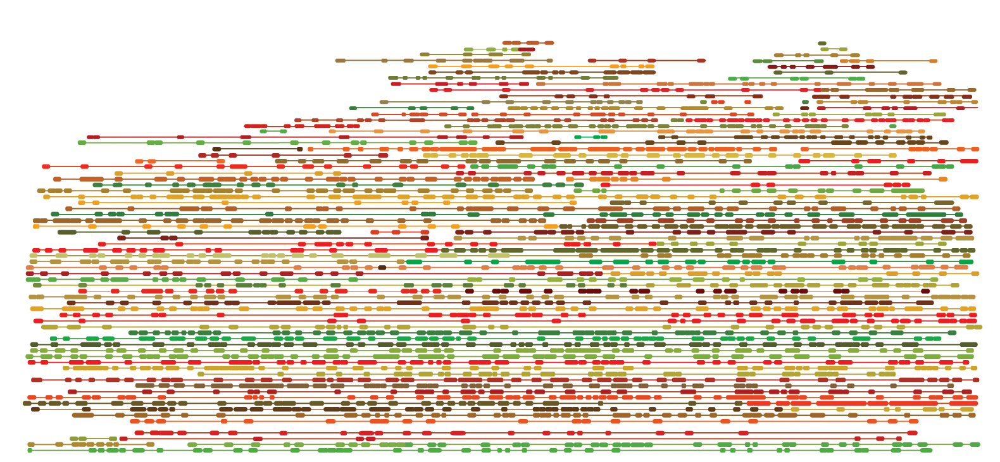

## Tigmint

### Correcting Misassemblies Using Linked Reads From Large Molecules

**Shaun Jackman** [\@sjackman][]

Lauren Coombe, Justin Chu, Rene L Warren, Benjamin P Vandervalk, Sarah Yeo, Zhuyi Xue, Hamid Mohamadi, Joerg Bohlmann, Steven JM Jones, Inanc Birol

| RECOMB-Seq 2018-04-20
| <https://sjackman.ca/tigmint-recomb-slides>
| Funded by Genome Canada &middot; Genome BC &middot; NIH &middot; NSERC
| [][cc-by]

[\@sjackman]: http://twitter.com/sjackman
[cc-by]: http://creativecommons.org/licenses/by/4.0/

## Shaun Jackman

| [Birol Bioinformatics Technology Lab](http://www.birollab.ca)
| [BC Cancer Genome Sciences Centre](http://bcgsc.ca) &middot; Vancouver, Canada
| [\@sjackman][] &middot; [github.com/sjackman](https://github.com/sjackman) &middot; [sjackman.ca](http://sjackman.ca)
| 

## Linked Reads

| 

## Tools for Linked Reads

| **Align linked reads**
| Lariat (Long Ranger) &middot; EMA
| **Structural variants**
| Long Ranger &middot; GROC-SVs &middot; NAIBR &middot; SVenX &middot; Topsorter
| **Phase variants**
| Long Ranger
| **Genome sequence assembly**
| Supernova
| **Scaffolding**
| ARCS &middot; Architect &middot; Fragscaff &middot; Scaff10x

<https://github.com/johandahlberg/awesome-10x-genomics>

## Contigs and scaffolds come to an end due to...

- repeats
- sequencing gaps
- structural variation
- misassemblies

## Misassemblies limit contiguity

particularly for highly contiguous assemblies.

Most scaffolding tools do not correct misassemblies.

----------------------------------------

| 

----------------------------------------

| 
| Correct misassemblies
| 

----------------------------------------

| 
| Correct misassemblies
| 
| Scaffold
| 

----------------------------------------

{.plain}

## Method

::: incremental

- Map reads to the assembly
- Group reads within *d* bp of each other (*d* = 50 kbp)
- Infer start and end coordinates of molecules
- Construct an interval tree of the molecules
- Each *w* bp region ought to be spanned by *n* molecules \
  (*w* = 1 kbp, *n* = 20)
- Identify regions with fewer than *n* spanning molecules
- Cut sequences at regions with insufficient coverage

:::

----------------------------------------

| Tracks from top to bottom
| molecule coverage, molecules, read coverage, reads

----------------------------------------

## Results

- Assembly of human HG004 with PE, MP, and linked reads
- Scaffolding with ARCS improved NGA50 from 3 to 8 Mbp
- Tigmint reduced misassemblies by 216 (27% reduction)
- Tigmint + ARCS improved NGA50 over five-fold to 16 Mbp

&nbsp;

| **`bwa mem`** Map reads to assembly
| 5&frac12; hours, 17 GB RAM, 48 threads
| **`tigmint-molecule`** Group reads into molecules
| 3&frac14; hours, 0.08 GB RAM, 1 thread
| **`tigmint-cut`** Identify misassemblies and cut sequences
| 7 minutes, 3.3 GB RAM, 48 threads

----------------------------------------

{height=500px}

Supernova uses only linked reads, others PE+MP+LR.

----------------------------------------

## Conclusion

Scaffolding after correcting with Tigmint yields an assembly both more correct and more contiguous.

Linked reads permit cost-effective assembly of large genomes using high-throughput sequencing.

fin
================================================================================

## Shaun Jackman

[\@sjackman][] &middot; [github.com/sjackman](https://github.com/sjackman) &middot; [sjackman.ca](http://sjackman.ca)

Lauren Coombe, Justin Chu, Rene L Warren, Benjamin P Vandervalk, Sarah Yeo, Zhuyi Xue, Hamid Mohamadi, Joerg Bohlmann, Steven JM Jones, Inanc Birol

| **Tigmint**
| <https://github.com/bcgsc/tigmint>

| **Slides**
| <https://sjackman.ca/tigmint-recomb-slides>

| **Markdown source code**
| <https://github.com/sjackman/tigmint-recomb-slides>

Funded by Genome Canada &middot; Genome BC &middot; NIH &middot; NSERC

Supplementary Slides
================================================================================

## 10x Genomics Linked Reads

| 

## Scatter Plot

| 

## Graph of 10 kbp segments sharing barcodes

